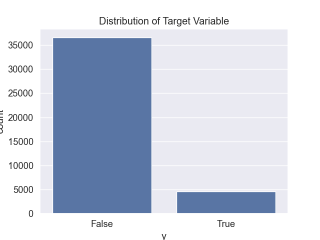
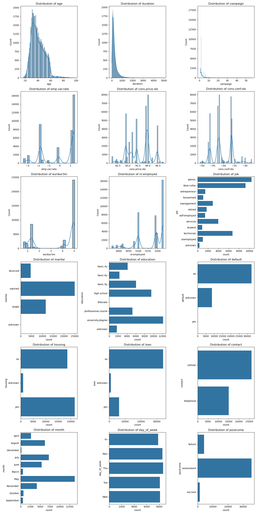
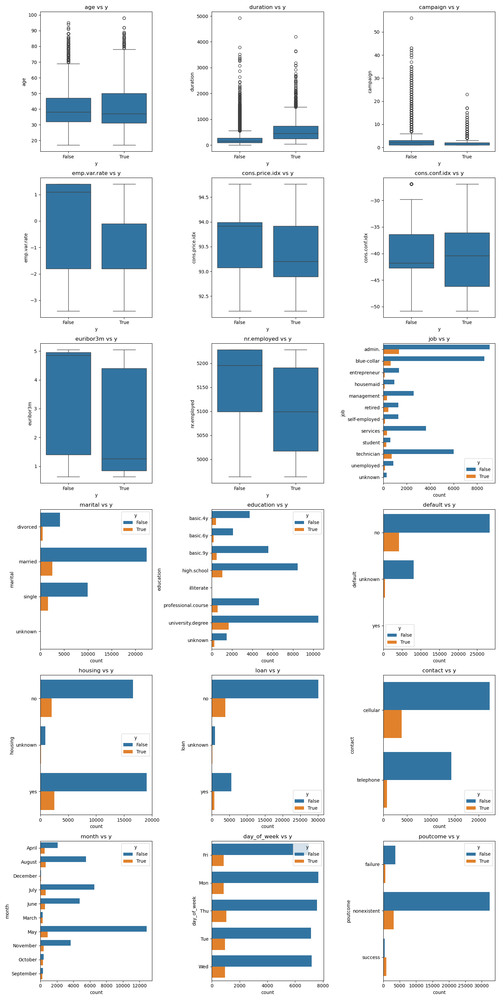
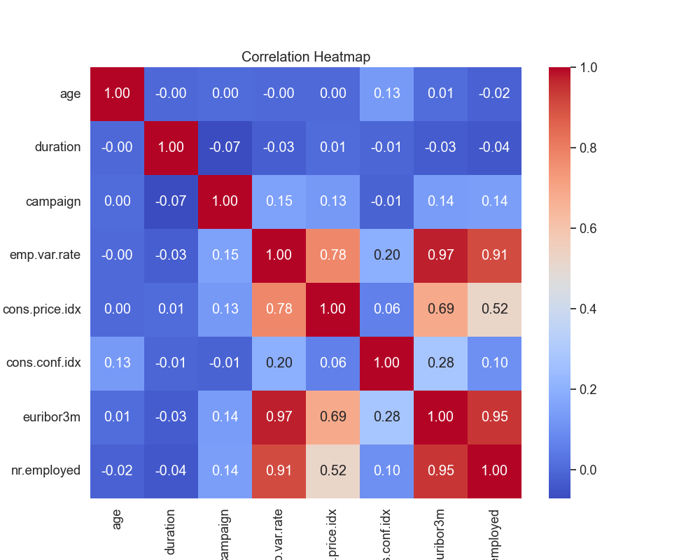
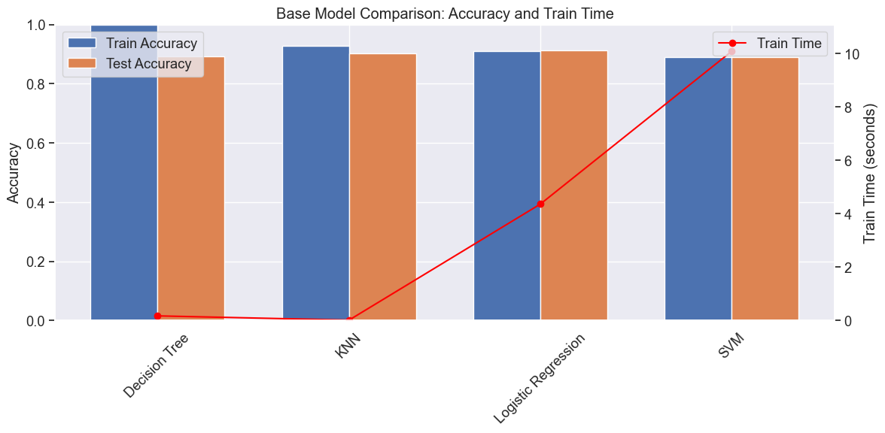
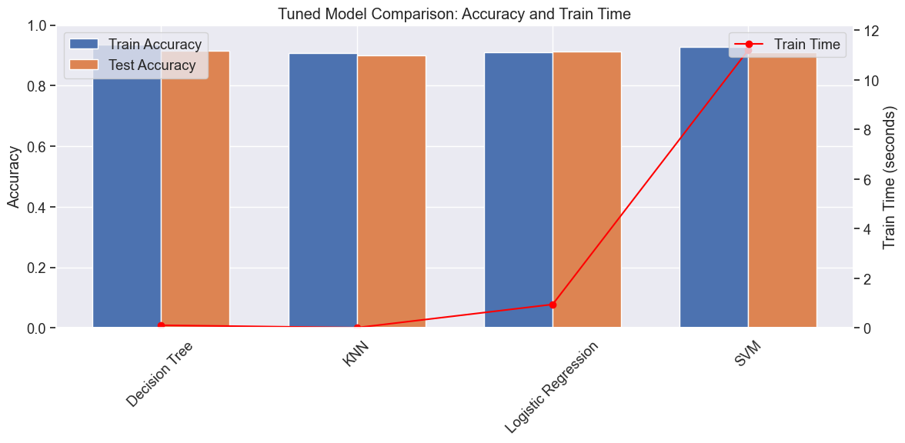

# Comparing Classifiers for Bank Marketing Data

## Overview

This project compares the performance of four machine learning classifiers (K Nearest Neighbor, Logistic Regression, Decision Trees, and Support Vector Machines) on a Portuguese banking institution dataset for predicting term deposit subscriptions. The analysis demonstrates how proper data preprocessing, feature engineering, and hyperparameter tuning can significantly improve model performance and reduce overfitting.

## Business Context

In the banking industry, marketing campaigns for financial products like term deposits require significant investment in time and resources. Understanding which clients are most likely to subscribe to term deposits allows banks to optimize their marketing efforts, reduce costs, and improve conversion rates. This analysis provides data-driven insights to help banks target the right customers with the right approach.

## Dataset Information

- **Source**: UCI Machine Learning repository - Portuguese banking institution marketing campaigns
- **Target**: Predict whether a client will subscribe to a term deposit (binary classification)
- **Original Features**: 21 features including client demographics, campaign details, and economic indicators
- **Campaigns Represented**: 17 marketing campaigns
- **Dataset Link**: [Bank Marketing Dataset](https://archive.ics.uci.edu/ml/datasets/bank+marketing)

## Data Cleaning and Preprocessing

### Data Quality Assessment
- **Missing Values**: No missing values were found in the dataset
- **Target Distribution**: 89% baseline accuracy (majority class prediction)
- The dataset shows class imbalance with majority of clients not subscribing to term deposits



### Data Cleaning Steps

1. **Data Type Conversions**:
   - `day_of_week`: Capitalized and cleaned
   - `month`: Converted to month names using datetime formatting
   - Categorical variables: Converted to category dtype
   - Target variable `y`: Mapped to binary (1 for 'yes', 0 for 'no')

2. **Feature Removal**:
   - **Duration**: Removed entries with zero duration (highly affects target prediction)
   - **pdays**: Dropped column (96.86% of entries were 999, indicating no previous contact)
   - **previous**: Dropped column (86.32% of entries were 0)

3. **Encoding**:
   - **One-hot encoding**: Applied to all categorical variables using `pd.get_dummies()`
   - **Feature scaling**: StandardScaler applied to numerical features for tuned models
   - **Feature reduction**: Dropped highly correlated features (`cons.price.idx`, `euribor3m`) to reduce multicollinearity

## Exploratory Data Analysis

### Univariate Analysis
Distribution analysis of all features to understand data characteristics and identify potential outliers.



### Bivariate Analysis
Relationship analysis between features and the target variable to identify predictive patterns.



### Correlation Analysis
Correlation heatmap of numerical features to identify multicollinearity issues.



## Model Performance Comparison

### Base Model Results (Default Parameters)

| Model | Train Time (s) | Train Accuracy | Test Accuracy |
|-------|----------------|----------------|---------------|
| Decision Tree | 0.01 | 1.00 | 0.88 |
| KNN | 0.01 | 0.92 | 0.89 |
| Logistic Regression | 0.05 | 0.91 | 0.91 |
| SVM | 13.42 | 0.92 | 0.91 |

### Key Observations:
- **Decision Tree**: Fastest training but shows clear overfitting (100% train accuracy vs 88% test accuracy)
- **Logistic Regression**: Best balance of performance and training time
- **SVM**: Longest training time but competitive accuracy
- **KNN**: Fast training with good generalization



### Tuned Model Results (After Hyperparameter Optimization)

| Model | Train Time (s) | Train Accuracy | Test Accuracy | Best Parameters |
|-------|----------------|----------------|---------------|-----------------|
| Decision Tree | 0.0012 | 0.93 | 0.91 | criterion='gini', max_depth=10, min_samples_split=10 |
| KNN | 0.0008 | 0.92 | 0.91 | n_neighbors=9, weights='distance', metric='manhattan' |
| Logistic Regression | 0.0004 | 0.91 | 0.91 | C=10, solver='liblinear' |
| SVM | 0.0020 | 0.92 | 0.91 | C=10, kernel='rbf', gamma='scale' |

### Performance Improvements:

| Model | Test Accuracy Improvement | Overfitting Reduction | Training Time Change |
|-------|---------------------------|----------------------|---------------------|
| Decision Tree | +0.03 | Significant (1.00→0.93 train accuracy) | Faster |
| KNN | +0.02 | Maintained good generalization | Faster |
| Logistic Regression | No change | Maintained consistency | Faster |
| SVM | No change | Maintained consistency | Faster |



## Key Findings

### Best Performing Models:
1. **Logistic Regression**: Consistent 91% test accuracy, fastest training, good interpretability
2. **SVM**: 91% test accuracy with robust performance across parameter settings
3. **KNN**: 91% test accuracy with simple implementation and good generalization
4. **Decision Tree**: 91% test accuracy after tuning, but required careful regularization

### Important Insights:
- **All models achieved similar test accuracy (91%)** after proper tuning and feature engineering
- **Hyperparameter tuning was most beneficial for Decision Trees**, reducing overfitting significantly
- **Feature engineering** (removing correlated features, scaling) improved training efficiency across all models
- **Logistic Regression** emerged as the most practical choice due to its consistency, speed, and interpretability
- **The dataset's class imbalance** (89% baseline) was successfully addressed by all models, achieving meaningful improvement over majority class prediction

## Business Recommendations

1. **For production use**: Logistic Regression due to its reliability, speed, and interpretability
2. **For complex patterns**: SVM with RBF kernel showed robust performance
3. **For ensemble methods**: Decision Tree (post-tuning) could be valuable as a base learner
4. **Further improvements**: Consider advanced techniques like feature selection, ensemble methods, or addressing class imbalance with sampling techniques

## Technical Implementation

### Dependencies

```python
pandas==1.5.3
numpy==1.24.3
matplotlib==3.7.1
seaborn==0.12.2
scikit-learn==1.3.0
```

### Project Structure

```
comparing-classifiers/
├── README.md                          # This file
├── comparing_classifiers.ipynb        # Main analysis notebook
├── summary.md                         # Detailed analysis summary
├── data/
│   ├── bank-additional-full.csv       # Original dataset
│   └── bank_additional_cleaned.csv    # Cleaned dataset
├── images/
│   ├── target_distribution.png        # Target variable distribution
│   ├── univariate_plots.png          # Feature distribution analysis
│   ├── bivariate_plots.png           # Feature-target relationships
│   ├── correlation_heatmap.png       # Feature correlation matrix
│   ├── model_comparison.png          # Base model performance
│   └── tuned_model_comparison.png    # Optimized model performance
└── CRISP-DM-BANK.pdf                 # Research paper reference
```

### How to Run

1. **Setup Environment**:
   ```bash
   pip install pandas numpy matplotlib seaborn scikit-learn jupyter
   ```

2. **Run Analysis**:
   ```bash
   jupyter notebook comparing_classifiers.ipynb
   ```

3. **View Results**: All visualizations are saved in the `images/` directory

### Data Processing Pipeline

1. **Data Loading & Exploration**
   ```python
   # Load data with proper separator
   df = pd.read_csv('data/bank-additional-full.csv', sep=';')
   
   # Check for missing values and data types
   df.isnull().sum()
   df.info()
   ```

2. **Data Cleaning & Feature Engineering**
   ```python
   # Remove zero duration entries
   df = df[df['duration'] != 0]
   
   # Drop columns with high percentage of missing/default values
   df = df.drop(columns=['pdays', 'previous'])
   
   # Convert categorical variables
   df['y'] = df['y'].map({'yes': 1, 'no': 0})
   ```

3. **Feature Encoding & Scaling**
   ```python
   # One-hot encoding for categorical variables
   X = pd.get_dummies(df.drop('y', axis=1))
   
   # Standard scaling for numerical features
   scaler = StandardScaler()
   X_scaled = scaler.fit_transform(X)
   ```

4. **Model Training & Evaluation**
   ```python
   # Train-test split with stratification
   X_train, X_test, y_train, y_test = train_test_split(
       X, y, test_size=0.2, random_state=42, stratify=y
   )
   
   # Model training with timing
   start_time = time.time()
   model.fit(X_train, y_train)
   train_time = time.time() - start_time
   ```

5. **Hyperparameter Optimization**
   ```python
   # Grid search with cross-validation
   grid_search = GridSearchCV(
       estimator=model, 
       param_grid=param_grid,
       scoring='accuracy', 
       cv=5, 
       n_jobs=-1
   )
   grid_search.fit(X_train, y_train)
   ```

### Model Configurations

#### Logistic Regression
```python
LogisticRegression(
    C=10,                    # Regularization strength
    solver='liblinear',      # Optimization algorithm
    max_iter=1000           # Maximum iterations
)
```

#### K-Nearest Neighbors
```python
KNeighborsClassifier(
    n_neighbors=9,          # Number of neighbors
    weights='distance',     # Weight function
    metric='manhattan'      # Distance metric
)
```

#### Decision Tree
```python
DecisionTreeClassifier(
    criterion='gini',       # Split quality measure
    max_depth=10,          # Maximum tree depth
    min_samples_split=10,  # Minimum samples to split
    random_state=42        # Reproducibility
)
```

#### Support Vector Machine
```python
SVC(
    C=10,                  # Regularization parameter
    kernel='rbf',          # Kernel type
    gamma='scale',         # Kernel coefficient
    random_state=42        # Reproducibility
)
```

### Evaluation Metrics

The models were evaluated using multiple metrics:

- **Accuracy**: Overall correctness of predictions
- **Training Time**: Computational efficiency
- **Classification Report**: Precision, recall, and F1-score
- **Confusion Matrix**: Detailed prediction breakdown

### Performance Monitoring

```python
# Comprehensive model evaluation
def evaluate_model(model, X_test, y_test, model_name):
    y_pred = model.predict(X_test)
    
    print(f"{model_name} Results:")
    print(f"Accuracy: {accuracy_score(y_test, y_pred):.3f}")
    print(f"Classification Report:\n{classification_report(y_test, y_pred)}")
    print(f"Confusion Matrix:\n{confusion_matrix(y_test, y_pred)}")
```

## Methodology Details

### Feature Selection Strategy
- Correlation analysis to identify multicollinear features
- Domain knowledge application for feature relevance
- Empirical testing of feature combinations

### Cross-Validation Approach
- 5-fold stratified cross-validation for hyperparameter tuning
- Consistent random states for reproducible results
- Grid search for comprehensive parameter exploration

### Model Selection Criteria
1. **Predictive Performance**: Test accuracy as primary metric
2. **Computational Efficiency**: Training time considerations
3. **Generalization**: Train-test accuracy gap analysis
4. **Interpretability**: Business stakeholder requirements

## Conclusion

This comprehensive analysis demonstrates that with proper preprocessing and hyperparameter tuning, multiple machine learning algorithms can achieve competitive performance (91% accuracy) on the bank marketing dataset. **Logistic Regression emerges as the optimal choice** for production deployment due to its consistent performance, computational efficiency, and interpretability for business stakeholders.

The methodology showcases best practices in machine learning workflow, including systematic data preprocessing, comprehensive model comparison, and thorough performance evaluation. These techniques can be applied to similar classification problems in the financial services industry.

**Key Success Factors:**
- Systematic data cleaning and feature engineering
- Comprehensive hyperparameter optimization
- Balanced evaluation considering multiple criteria
- Focus on practical deployment considerations

---

*Analysis based on 41,188 bank marketing records using four machine learning classifiers with 91% test accuracy*

## Contact & Support

For questions about this analysis or implementation details, please refer to the Jupyter notebook `comparing_classifiers.ipynb` for complete code and methodology.
